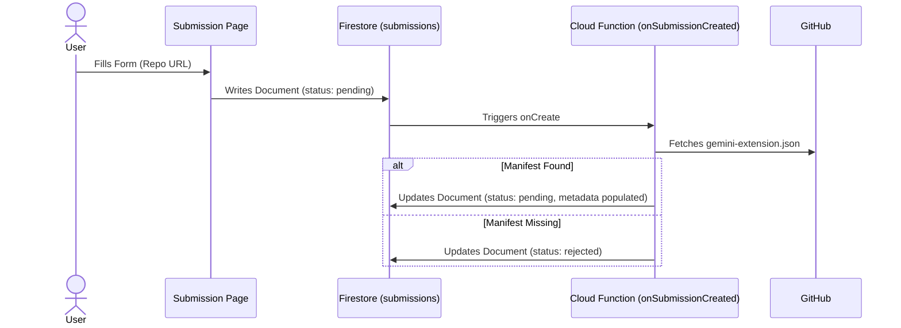
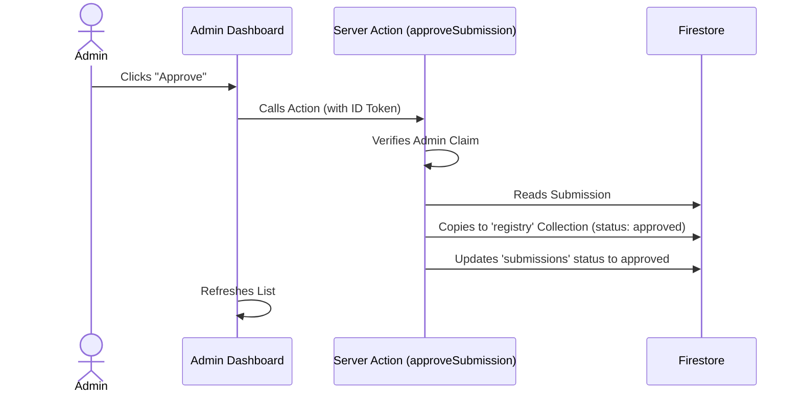
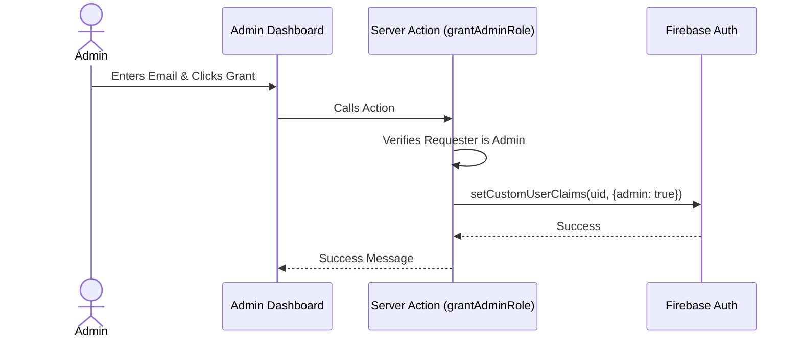

# System Architecture

## Overview

The Cymbal Coffee Extension Registry is a Next.js application hosted on Firebase App Hosting. It leverages Firebase services for authentication, data storage, and backend logic.

## Architecture Diagram

```mermaid
graph TD
    subgraph "Client (Browser)"
        UI[Next.js Frontend]
        AuthSDK[Firebase Auth SDK]
    end

    subgraph "Firebase Infrastructure"
        AppHosting[Firebase App Hosting\n(Cloud Run)]
        Firestore[(Cloud Firestore)]
        Auth[Firebase Authentication]
        CloudFunc[Cloud Functions v2]
    end

    UI -->|Next.js Server Actions| AppHosting
    UI -->|Reads| Firestore
    UI -->|Sign In| Auth
    
    AppHosting -->|Verify Token & Admin Logic| Auth
    AppHosting -->|Read/Write| Firestore
    
    Firestore -->|Trigger onCreate| CloudFunc
    CloudFunc -->|Validation| Firestore
```

## Data Flow Diagrams

### 1. Submission Workflow



### 2. Approval Workflow



### 3. User Role Management


